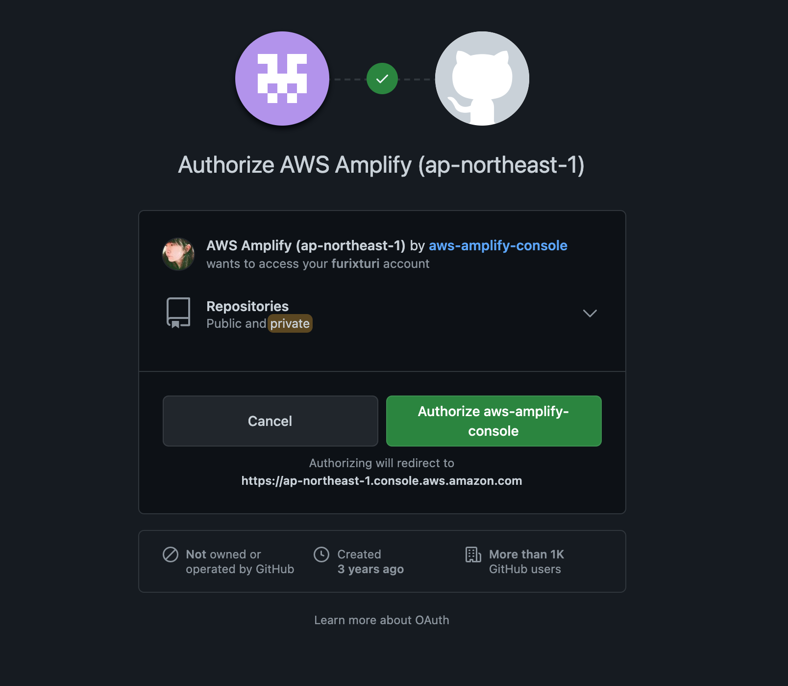
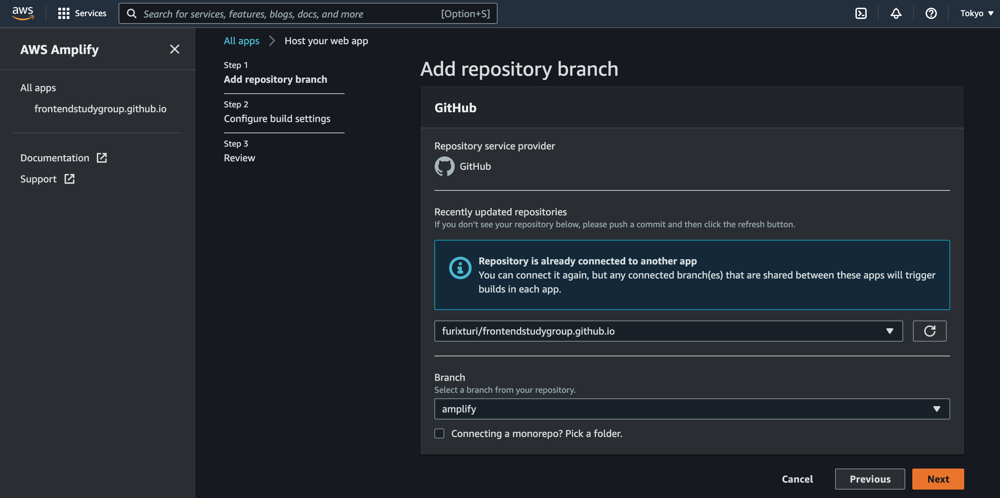
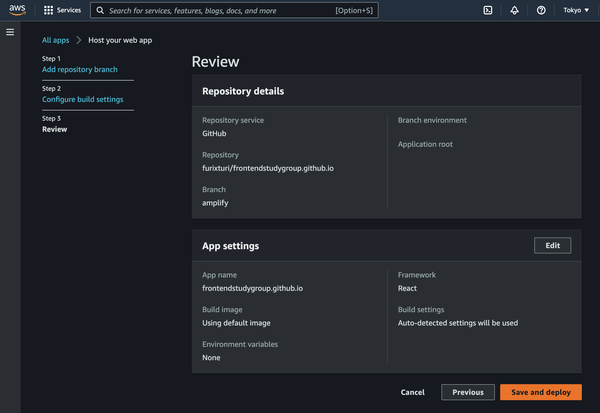
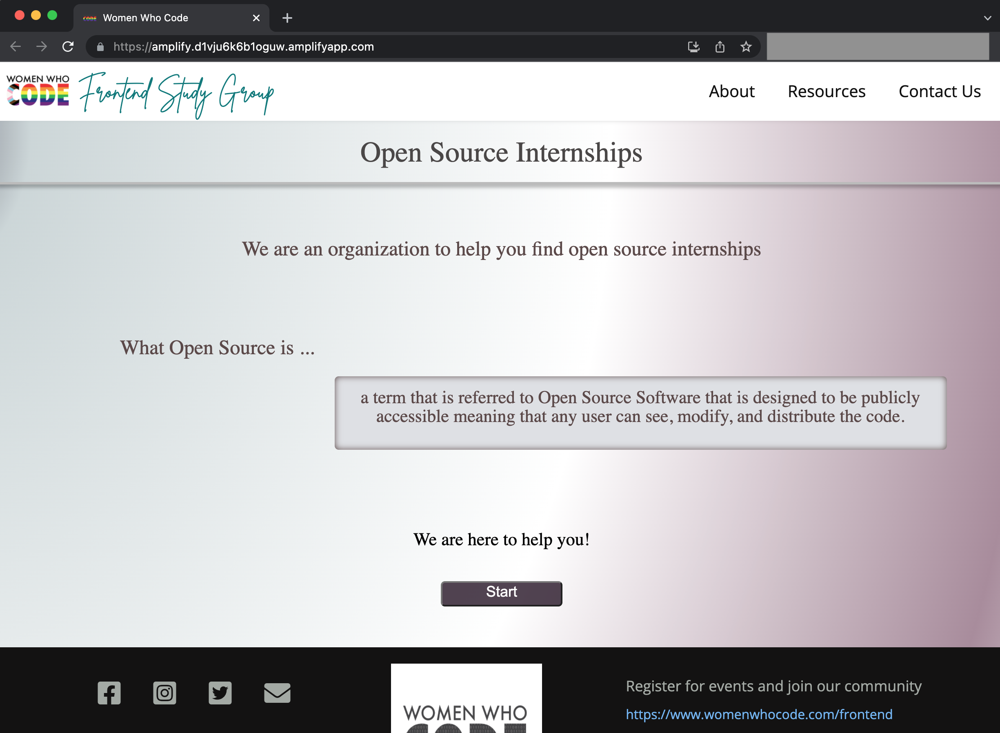

# Deploy A React App to AWS with AWS Amplify

## What is AWS Amplify?
AWS Amplify is a set of purpose-built tools and features that lets frontend web and mobile developers quickly and easily build full-stack apps on AWS. 

With Amplify, you can configure a web or mobile app backend, connect your app in minutes, visually build a web frontend UI, and easily manage app content outside the AWS console. 

The AWS Amplify Console offers a simple Git-based workflow for building and deploying static web apps to AWS. It only takes about 15 minutes to connect your repository, configure build settings, and deploy.

## Deploy Your React App on AWS with AWS Amplify

AWS Amplify offers a fully managed CI/CD and hosting service. Leveraging this service, developers can deploy their single page applications (SPA) or server-side rendered (SSR) front end apps on AWS by simply connecting their Git repository, with zero config.

### 1. Get Started with AWS Amplify Hosting

Open the AWS management console, search for "Amplify" in the search bar on the top and open the AWS Amplify console.


Scroll down to the "Get started" section and click the "Get started" button in the "Amplify Hosting" column.

### 2. Connect Your App's Git Repository

In the screen that follows, choose the Git repository where your React app resides. (If you're not using one of the supported Git providers, you can also choose "Deploy without Git provider" and provide your code manually by uploading, pointing to a zip file hosted on Amazon S3, or pointing to a URL.)


Having chosen a Git provider, if this is the first time you integrate with this Git provider, you will need to authorize AWS Amplify to access your repositories. The following screenshot shows an example integration with GitHub.



After AWS Amplify is authorized to access your repositories, you can select your React app's repository and the branch you use for deployment.


### 3. Review Auto-detected Build Settings and Deploy

When you deploy an app with the Amplify Console, it automatically detects the front end framework and associated build settings by inspecting the `package.json` file in your repository. 

This step actually generates a build specification YAML file for you. Amplify will use these settings to run your build, unless you create an `amplify.yml` file and store it in your repository. 


You can edit the build specifications in the console, for example, to add a backend build section or a test section. For more information on the build settings, check out [this page of the AWS Amplify documentation](https://docs.aws.amazon.com/amplify/latest/userguide/build-settings.html).

Next, review your repository details and app settings and hit that "Save and deploy" button!



### 4. Monitor Your Deployment and See the App on AWS

After you hit the deploy button, you're taken to your AWS Amplify app page where you can see the build and deployment pipeline with real time progress. In the tabs below you can also inspect each step's console output.


When you deploy your web app with the Amplify Console, Amplify hosts it on a URL like the following example: 

```
https://<branch-name>.<some-random-hash>.amplifyapp.com
```

You can of course connect your own custom domain to your app so that users can access your app with the domain of your choice. The Amplify Console also issues an SSL/TLS certificate for all domains connected to your app so that all traffic is secured through HTTPS/2.

For now, just open the Amplify provided domain and see your React app running on AWS!



## Next Steps

Now that you've got your front end app running on the cloud, you might want to configure a backend or add authentication to make it more dynamic and secure. Check out these helpful official tutorials:

- [Build a powerful backend data model](https://aws.amazon.com/amplify/datastore/)
- [Add user authentication](https://aws.amazon.com/amplify/authentication/)

To further explore AWS Amplify and learn more advanced use cases, check out the [community resources on AWS Amplify homepage](https://amplify.aws/community/resources), where you can find self-paced workshops and slide decks.

P.S.: If you don't have an AWS account yet, it is fairly easy to sign up and create one. AWS offers a 12-months free tier that allows you to explore and gain hands-on experiences on most of the services. On top of that, there are also short term free trials and always free offers depending on the services you use. For more information, check out [https://aws.amazon.com/free/](https://aws.amazon.com/free/).