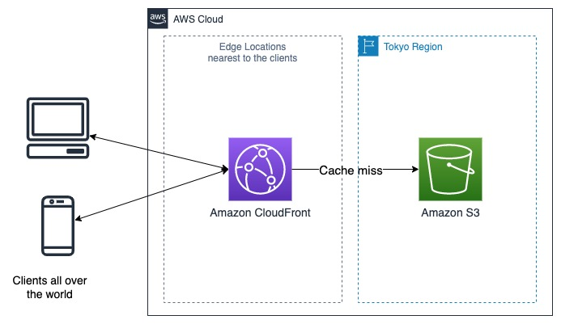

# Deploy and host a React app on AWS with Amazon S3 and Amazon CloudFront


- [Deploy and host a React app on AWS with Amazon S3 and Amazon CloudFront](#deploy-and-host-a-react-app-on-aws-with-amazon-s3-and-amazon-cloudfront)
  - [What are Amazon S3 and Amazon CloudFront](#what-are-amazon-s3-and-amazon-cloudfront)
    - [Amazon S3](#amazon-s3)
    - [Amazon CoudFront](#amazon-coudfront)
  - [Deploy and host a React app with Amazon S3 and Amazon CloudFront](#deploy-and-host-a-react-app-with-amazon-s3-and-amazon-cloudfront)
    - [Host your React app on Amazon S3](#host-your-react-app-on-amazon-s3)
    - [Setup Amazon CloudFront to serve your React app](#setup-amazon-cloudfront-to-serve-your-react-app)

## What are Amazon S3 and Amazon CloudFront

### Amazon S3

[Amazon Simple Storage Service (Amazon S3)](https://aws.amazon.com/s3/) is an object storage service that offers industry-leading scalability, data availability, security, and performance. It is designed to deliver 99.999999999% durability and scale past trillions of objects worldwide.

You can use Amazon S3 to store and protect any amount of data for a range of use cases, such as data lakes, websites, mobile applications, backup and restore, archive, enterprise applications, IoT devices, and big data analytics. 

### Amazon CoudFront

[Amazon CloudFront](https://aws.amazon.com/cloudfront/) is a content delivery network ([CDN](https://en.wikipedia.org/wiki/Content_delivery_network)) service that speeds up distribution of your static and dynamic web content, such as .html, .css, .js, and image files, to your users. It delivers your content through a worldwide network of AWS data centers called edge locations. When a user requests content that you're serving with CloudFront, the request is routed to the edge location that provides the lowest latency (time delay). From there:
- If the content is already in the edge location with the lowest latency, CloudFront delivers it immediately.
- If the content is not in that edge location, CloudFront retrieves it from an origin that you've defined—such as an Amazon S3 bucket, a MediaPackage channel, or an HTTP server (for example, a web server) that you have identified as the source for the definitive version of your content.

In this way, your content is delivered to your users with the best possible performance. 

## Deploy and host a React app with Amazon S3 and Amazon CloudFront

When you're ready to release your React app to the world, you run your build script to [create a production build](https://create-react-app.dev/docs/production-build) for deployment. This build will contain your `index.html` file, JavaScript, CSS files and other static assets. It is a perfect example of a static website, which contains individual webpages, client-side scripts and other static assets. 

(By contrast, a dynamic website relies on server-side processing, including server-side scripts, such as PHP, JSP, or ASP.NET. Amazon S3 does not support server-side scripting, but AWS has other resources for hosting dynamic websites.)

You can use Amazon S3 to host your React app leveraging its support for hosting static websites. To enhance scalability and performance, you can use Amazon CloudFront as your CDN, which caches your static content in edge locations and serve clients all over the world from the nearest edge location. If you want to use HTTPS, which is generally a requirement by default these days, you can also leverage CloudFront. CloudFront assigns a default domain name and if you use this domain name, you can also use the default CloudFront SSL/TLS certificate. If you have your own certificate, you can also use it with CloudFront.



### Host your React app on Amazon S3 

To use S3 for a static website, you can simply upload files to an S3 bucket and configure your S3 bucket for web hosting. 

Prerequisite: the following steps assume that you have an AWS account with appropriate access privileges. To create an AWS account, follow the steps [here](https://aws.amazon.com/premiumsupport/knowledge-center/create-and-activate-aws-account/).

1. Open the [Amazon S3 Console](https://console.aws.amazon.com/s3/). Choose the bucket you want to use for hosting from the **Buckets** list, or create a new bucket.
2. Enable static website hosting: 
   - Open the bucket's details page and go to its **Properties** tab. Find the **Static website hosting** section at the bottom, click **Edit** and choose **Enable**. More configurations will show up at this point.
   - Choose the **Hosting type** to be **Host a static website**.
   - Specify the **Index document** to be `index.html` (the html page that contains your React app script tag and is the entry point of your website).
   - Save the changes.
3. Grant public read access to your website:
   - Open the **Permissions** tab in the bucket's detail page
   - **Edit**  the **Block public access (bucket settings)** section to *uncheck* **Block all public access**
   - **Edit** the **Bucket policy** section and add an S3 bucket policy to grant public read access for your website. You can use the following sample policy from the [official documentation](https://docs.aws.amazon.com/AmazonS3/latest/userguide/HostingWebsiteOnS3Setup.html#step4-add-bucket-policy-make-content-public). *Remember to replace the `Bucket-Name` placeholder with your bucket's name*.
```json 
{
    "Version": "2012-10-17",
    "Statement": [
        {
            "Sid": "PublicReadGetObject",
            "Effect": "Allow",
            "Principal": "*",
            "Action": [
                "s3:GetObject"
            ],
            "Resource": [
                "arn:aws:s3:::Bucket-Name/*"
            ]
        }
    ]
}
```
4. Upload the content of your React app's `build` folder to the S3 bucket. 

Now your React app is ready for visit on the cloud! 

When you configure your bucket as a static website, the website is available at the AWS Region-specific [website endpoint](https://docs.aws.amazon.com/AmazonS3/latest/userguide/WebsiteEndpoints.html) of the bucket. Depending on your bucket's AWS Region, this Amazon S3 website endpoint follows one of these two formats.
- s3-website dash (-) Region: http://bucket-name.s3-website-Region.amazonaws.com
- s3-website dot (.) Region: http://bucket-name.s3-website.Region.amazonaws.com 

To find the URL of your S3 hosted static website, go to the S3 bucket's **Properties** tab, scroll down to the bottom and find the **Bucket website endpoint** URL in the **Static website hosting** section. Click the URL and you'll see your React app website hosted in Amazon S3 on AWS!

For a more generic and detailed walkthrough tutorial of hosting static websites on Amazon S3, refer to this official documentation tutorial: [Tutorial: Configuring a static website on Amazon S3](https://docs.aws.amazon.com/AmazonS3/latest/userguide/HostingWebsiteOnS3Setup.html)

If you'd like to use your own domain, this [official documentation tutorial](https://docs.aws.amazon.com/AmazonS3/latest/userguide/website-hosting-custom-domain-walkthrough.html) provides an example walkthrough to use a custom domain registered with AWS's domain service [Amazon Route 53](https://aws.amazon.com/route53/).

### Setup Amazon CloudFront to serve your React app

Amazon S3 website endpoints do not support HTTPS. If you want to use HTTPS to make your React app website more secure, you can use Amazon CloudFront to serve your static website hosted on Amazon S3. Also, don't forget the scalability and performance benefits that CloudFront provides as a CDN service.

1. Go to [CloudFront Console](https://console.aws.amazon.com/cloudfront/v3/home) and click **Create a CloudFront distribution**
2. For **Origin domain**, choose the Amazon S3 bucket hosting your React app website. The origin name will be filled out automatically.
3. For the **S3 bucket access setting**, we choose to restrict access to the S3 bucket for better security by using a CloudFront origin access identity (OAI) 
   - Check the radio button **Yes use OAI (bucket can restrict access to only CloudFront)**  
   - In the **Origin access identity** field below, click **Create new OAI** next to the dropdown.
   - For **Bucket policy**, check the **Yes, update the bucket policy** radio button.
4. Scroll down to the **Settings** section, find the **Default root object - optional** field and type in your website's entry point html file name (e.g., `index.html`), so that CloudFront will return serve this html file when users access your website root.
5. Leave all other settings as default. Click **Create distribution**.

Wait for some minutes until the CloudFront distribution's **Last modified** field turns from `Deploying` to a timestamp. Copy the **Distribution domain name**, from the console, for example, `dnmcxcbfx8f5k.cloudfront.net`. Enter this domain name in a browser tab and verify that you can access your React app website through this CloudFront domain.

Now to secure your S3 bucket so that only CloudFront can access it to serve your React app website, we will remove the S3 policy which allowed public read access from anyone.

1. Go to S3 console and open your hosting S3 bucket's **Permissions** tab.
2. In the **Bucket policy** section, you can see that CloudFront has created a new policy to allow OAI access from CloudFront for us. It would be in something like the following:
```json
    // Created by CloudFront, this is the only policy we need from now on.
    {
        "Sid": "2",
        "Effect": "Allow",
        "Principal": {
            "AWS": "arn:aws:iam::cloudfront:user/CloudFront Origin Access Identity OAI-ID"
        },
        "Action": "s3:GetObject",
        "Resource": "arn:aws:s3:::Bucket-Name/*"
    }
```
This will be the only policy we need from now. So let's keep this and delete the old policy we created earlier
```json
    // Created earlier when we configured the bucket for static website hosting
    // We do not need this anymore
    {
        "Sid": "PublicReadGetObject",
        "Effect": "Allow",
        "Principal": "*",
        "Action": "s3:GetObject",
        "Resource": "arn:aws:s3:::Bucket-Name/*"
    }
```
The final bucket policy should be like this, with `OAI-ID` and `Bucket-Name` being placeholders for your specific values.
```json
{
    "Version": "2012-10-17",
    "Statement": [
        {
            "Sid": "2",
            "Effect": "Allow",
            "Principal": {
                "AWS": "arn:aws:iam::cloudfront:user/CloudFront Origin Access Identity OAI-ID"
            },
            "Action": "s3:GetObject",
            "Resource": "arn:aws:s3:::Bucket-Name/*"
        }
    ]
}
```
Now your bucket is no longer publicly accessible to anyone. It is secured and accessible to only you, the bucket owner, and the CloudFront distribution, which you explicitly granted access with the bucket policy. And with CloudFront distribution, you can use HTTPS for your React app website. That's some great security improvements.

